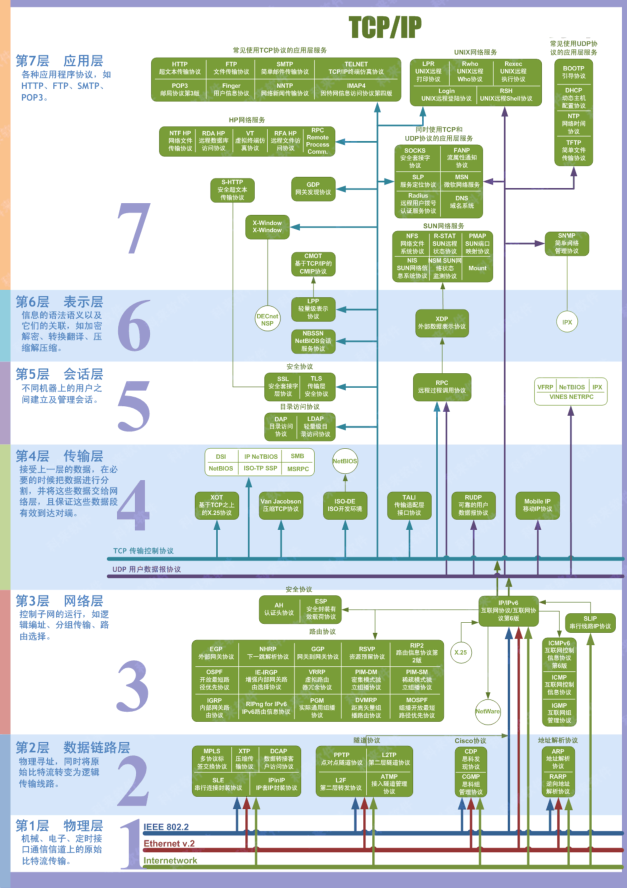
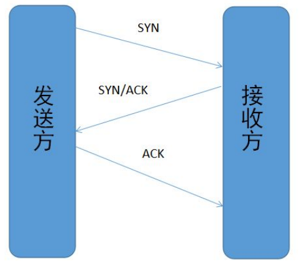
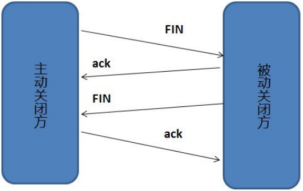

# 计算机基础

[TOC]


## 3.1 计算机网络

### 3.1.1 OSI与TCP/IP各层的结构和功能

1.OSI结构体系7层

​    应用层->表示层->会话层->运输层->网络层->数据链路层->物理层

2.TCP/IP的体系结构

​    应用层->运输层->网际层->网络接口层

3.五层协议

​    应用层->运输层->网络层->数据链路层->物理层

#### 应用层

应用层的任务是通过应用进程间的交互来完成特定网络应用。

DNS HTTP SMTP POP3

#### 运输层

运输层的主要任务就是负责向两台主机进程之间的通信提供通用的数据传送服务。

运输层的两种主要协议：

1. TCP(Transmission Control Protocol) -- 提供**面向连接**的，**可靠的**数据传输服务
2. UDP(User Datagram Protocol)--提供**无连接**的，尽最大努力的数据传输服务（不保证数据传输的可靠性）

#### 网络层

在计算机网络中进行通信的两个计算机之间可能会经过很多个数据链路，也可能还要经过很多通信子网。网络层的任务就是选择合适的网间路由和交换结点，确保数据及时传送。

#### 数据链路层

两台主机之间的数据传输，总是在一段一段的链路上传送的，这就需要使用专门的链路层的协议。数据链路层将网络层交下来的IP数据包组成帧。

#### 物理层

实现相邻计算机节点之间比特流的透明传送，尽可能屏蔽掉具体传输介质和物理设备的差异。



### 3.1.2 TCP三次握手和四次挥手

为了准确无误地把数据送达目标处，TCP协议采用了三次握手策略。

#### TCP三次握手流程



- 客户端-发送带有SYN标志的数据包-服务端 （一次握手）

- 服务端-发送带有SYN/ACK标志的数据包-客户端（二次握手）

  客户端-发送带有ACK标志的数据包-服务端（三次握手）

- 

#### 为什么要三次握手

三次握手的目的是为了建立可靠的通信信道。三次握手最主要的目的就是双方确认自己与对方的发送和接受是正常的。

```
第一次握手：Client什么都无法确认；Server可确认对方发送正常，自己接收正常。
第二次握手：Client可确认自己发送、接收正常，对方发送、接收正常；Server确认对方发送正常，自己接收正常(无法根据这次握手，增加判断)。
第三次握手：Client确认自己发送、接收正常，对方发送、接收正常；Server可确认对方发送、接收正常，自己发送、接收正常。
```

#### 为什么第二次握手要传回SYN

接收端传回发送端所发送端SYN是为了告诉发送端，我接受到的信息确实就是你所发送的信号。

#### 为什么传了SYN，还要传ACK

双方通信无误必须两者互相发送信息都无误。传了SYN，证明发送方到接收方的通道没有问题，但是接收方到发送方的通道还需要ACK信号来进行验证。

#### 四次挥手



断开一个TCP连接则需要“四次挥手”

- 客户端-发送一个FIN-服务端，用于关闭客户端到服务器的数据传送（第一次挥手）
- 服务端-收到FIN，发送一个ACK，确认序号为收到序号+1。
- 服务端-发送一个FIN-客户端，用于关闭与客户端的连接
- 客户端-发回ACK报文确认，并将确认序号设置为收到序号+1

#### 为什么要四次挥手

任何一方都可以在数据传送结束后发出连接释放的通知，待对方确认后进入半关闭状态。当另一方也没有数据再发送的时候，则发出连接释放通知，对方确认后就完全关闭了TCP连接。

### 3.1.2 TCP,UDP协议的区别


UDP传送数据之前不需要建立连接，提供一个无连接的数据传输服务，远程主机在收到UDP报文后，不需要给出任何确认。传输效率高，虽然不提供可靠交互，但在某些情况下UDP确是一种最有效的工作方式（一般用于即时通信），比如QQ语音、QQ视频、直播等。

```
为什么UDP不可靠，还要应用于即时通信呢？
   UDP不可靠但是效率高，传输开销小，无连接不会持续占用服务器的连接资源，适用于实时数据的传输，即使偶尔丢失一两个数据包，也不会对接受结果产生太大影响。
```

TCP提供面向连接的服务。在传送数据之前必须建立连接，数据传送结束后要释放连接。TCP不提供广播或者多播服务。由于TCP提供可靠的、面向连接的传输服务，难以避免的增加了许多开销，如确认、流量控制、计时器以及连接管理。这不仅使协议数据单元的首部增大很多，还要占用许多的处理机资源。TCP一般用于文件传输、发送和接受邮件、远程登录等场景。

### 3.1.3 TCP 协议如何保证可靠传输

应用数据被分割成TCP认为最适合发送的数据块

TCP给发送的每一个包进行编号，接收方对数据包进行排序，把有序数据传送给应用层。

**校验和：**TCP将保持它首部和数据的校验和。这是一个端对端的校验和，目的是检测数据在传输过程中的任何变化。如果收到段的检验和有差错，TCP将丢弃这个保温段和不确认收到此报文段。

TCP的接收端会丢弃重复的数据。

**流量控制：**TCP连接的每一方都有固定大小的缓冲空间，TCP的接收端只允许发送端发送接收端缓冲区能接纳的数据。当接收方来不及处理发送方的数据，能提示发送方降低发送的速率，防止包丢失。TCP使用的流量协议是可变大小的滑动窗口协议。

**拥塞控制：**当网络拥塞时，减少数据的发送。

**ARQ协议：**也是为了实现可靠传输的，它的基本原理就是每发完一个分组就停止发送，等待对方确认。在收到确认后再发下一个分组。

**超时重传：**当TCP发出一个段后，它启动一个定时器，等待目的端确认收到这个报文段。如果不能及时收到一个确认，将重发这个报文段。

### 3.1.4 ARQ协议

**自动重传请求**（Automatic Repeat-reQuest, ARQ)是OSI模型中数据链路层和传输层的错误纠正协议之一。它通过使用确认和超时这两个机制，在不可靠服务的基础上实现可靠的数据传输。如果发送方在发送后一段时间之内没有收到确认帧，它通常会重新发送。ARQ包括停止等待ARQ协议和连续ARQ协议。

#### 停止等待ARQ协议

- 停止等待协议是为了实现可靠传输的，它的基本原理就是每发完一个分组就停止发送，等待对方确认（回复ACK）。如果过了一段时间（超时时间后），还是没有收到ACK确认，说明没有发送成功，需要重新发送，直到收到确认后再发下一个分组；
- 在停止等待协议中，若接收方收到重复分组，就丢弃该分组，但同时还要发送确认；

优点：简单

缺点：信道利用率低，等待时间长


### 3.1.5 在浏览器中输入Url地址->显示主页的过程

1. DNS解析
2. TCP连接
3. 发送HTTP请求
4. 服务器处理请求并返回HTTP报文
5. 浏览器解析页面
6. 连接结束

### 3.1.6 状态码

|      |                                |                            |
| ---- | ------------------------------ | -------------------------- |
|      | 类别                           | 原因短语                   |
| 1XX  | Informational(信息性状态码)    | 接受的请求正在处理         |
| 2XX  | Success(成功状态码)            | 请求正常处理完毕           |
| 3XX  | Redirection(重定向状态码)      | 需要进行附加操作以完成请求 |
| 4XX  | Client Error(客户端错误状态码) | 服务器无法处理请求         |
| 5XX  | Server Error(服务器错误状态吗) | 服务器处理请求错误         |

常见的HTTP状态码

200：表示从客户端发来的请求在服务器端被正常处理了

204(No Content):代表服务器接收的请求已被成功处理，但在返回的响应报文中不含该实体的主体部分。

206(Partial Content)：代表客户端进行了范围请求，而服务器成功执行了这部分的GET请求。

301(Moved Permanently)：永久性重定向。该状态码表示请求的资源已被分配到新的URI，以后应使用资源现在所指的URI。

302(Found)：临时重定向。该状态码表示请求的资源已被分配了新的URI，希望用户（本次）能使用新的URI访问。

303(See Other)：表示由于请求对应的资源存在另一个URI，应使用GET方法定向获取请求的资源。

304(Not Modified)：表示客户端发送附带条件的请求时，服务器端允许请求访问资源，但因发生请求未满足条件的情况后，直接返回304。

400(Bad Request)：表示请求报文中存在语法错误。

401(Unauthorized):表示发送的请求需要有通过HTTP认证的信息。另外若之前进行过1次请求，则表示用户认证失败。

403(Forbidden):表明对请求资源的访问被服务器拒绝了。

404(Not Found):表明服务器上无法找到请求的资源。

500(Internal Server Error):表明服务器端在执行请求时发生了错误。

503(Service Unavailable):表明服务器暂时处于超负载或者正在进行停机维护。

### 3.1.7 HTTP长连接，短连接

在HTTP/1.0中默认使⽤短连接。也就是说，客户端和服务器每进⾏⼀次HTTP操作，就建⽴⼀次连接，任务结束就中断连接。当客户端浏览器访问的某个HTML或其他类型的Web⻚中包含有其他的Web资源（如JavaScript⽂件、图像⽂件、CSS⽂件等），每遇到这样⼀个Web资源，浏览器就会重新建⽴⼀个HTTP会话。
⽽从HTTP/1.1起，默认使⽤⻓连接，⽤以保持连接特性。使⽤⻓连接的HTTP协议，会在响应头加⼊这⾏
代码：

```
Connection:keep-alive
```

在使⽤⻓连接的情况下，当⼀个⽹⻚打开完成后，客户端和服务器之间⽤于传输HTTP数据的TCP连接不会关闭，客户端再次访问这个服务器时，会继续使⽤这⼀条已经建⽴的连接。Keep-Alive不会永久保持连接，它有⼀个保持时间，可以在不同的服务器软件（如Apache）中设定这个时间。实现⻓连接需要客户端和服务端都⽀持⻓连接。

### 3.1.8 HTTP是不保存状态的协议，如何保存用户状态？

HTTP是一种不保存状态，即无状态(stateless)协议。使用Session来通过服务端记录用户的状态。

### 3.1.9 Cookie的作用是什么？和Session有什么区别？

Cookie和Session都是用来跟踪浏览器用户身份的会话方式，但是两者的应用场景不太一样。

**Cookie一般用来在客户端保存用户信息**

**Session一般用来在服务端记录用户状态**


### 3.1.10 URI和URL的区别是什么？

URI是统一资源标识符，可以唯一标识一个资源。

URL是同一资源定位器，可以提供该资源的路径。


### 3.1.11 HTTP和HTTPS的区别？

端口：HTTP使用80端口 HTTPS使用443端口

安全性：HTTP使用明文传输 HTTPS基于SSL/TLS进行加密传输

资源消耗：因为HTTPS要进行加密解密等操作，所以HTTPS比HTTP耗费更多的服务器资源。

